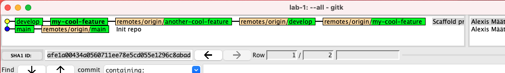

# Assignment 1 - Branching & Merging

Photo by [Joey Kyber](https://unsplash.com/@jtkyber1?utm_source=unsplash&utm_medium=referral&utm_content=creditCopyText) on [Unsplash](https://unsplash.com/s/photos/traffic?utm_source=unsplash&utm_medium=referral&utm_content=creditCopyText)

Understanding how **_commits_** and **_branches_** interplay is crucial for any working with Git. In this assignment you'll practice jumping between branches and joining histories together using both `merge` and `rebase`. By completing this assignment you'll also get to practice conflict resolution – another common theme for anyone working on shared code bases.

## Purpose & Goal
- Practice setting up repo and inviting collaborator
- Get comfortable working with branches
- Understand how the two main options (`merge` vs `rebase`) for integrating changes between branches works, and how they differ
- Understand how conflict resolution works

## Expectations
- Work in pairs
- For actions/operations performed on one computer – pair program!

## The assignment
Your task is to setup a new repository locally, publish it on Github and then invite your teammate to collaborate. You'll then copy-paste some existing source code into your project, before making modifications to it on your respective machines – finally merging it all together.

In short:
- [ ] Setup a new repo, invite collaborator
- [ ] Copy-paste code sample
- [ ] Create branches and make modifications (creating a divergent history)
- [ ] Integrate changes with `merge`
- [ ] Integrate changes with `rebase`
- [ ] Compare how the two operations differ

### Step 1.0 - Setup repo
1. **_Dev-1_**: Create a new project and initialize a repository locally on your computer. Add an empty `.gitignore`, commit it to your *__main__* branch and provide a decent commit message.
```
$ git init
$ touch .gitignore
$ git add .gitignore
$ git commit -m "Init repo"
```
Above commands does the trick straight from the command line, but you can of course create a new file straight from your IDE or OS if you'd like.

1. **_Dev-1_**: Create a new (empty) private repo on [Github](https://github.com/new) and publish your local repo to it by following the guide.
```
git remote add origin git@github.com:......
git push --set-upstream origin main
```

1. **_Dev-1_**: Invite your classmate as a collaborator to your new repo
1. **_Dev-2_**: Clone the repo
1. **_Dev-1_** & **_Dev-2_**: Verify that both of you have the code on your respective computers. By viewing the history locally using `gitk` it should look something like this:


### Step 1.1 - Import sample code
1. **_Dev-1_**: Create a new branch, from the tip of your `main` branch and switch to it; call it `develop`.
```
$ git switch -c develop
```

1. **_Dev-1_**: Copy the entire [src/](./src) folder from this repo (without modifying it) to the root of your project, `commit` and `push` to remote.
1. **_Dev-2_**: Verify that both of you have the latest code by fetching all changes from remote, and then checkout `develop`.
```
$ git fetch
$ git switch develop
```
History should now look like this:

  

1. **_Dev-1_** & **_Dev-2_**: Verify that you can view [src/index.html](./src/index.html) in your browser.

  

  If you have a small web server you can serve it up, otherwise you can just open the index.html file in a browser straight from your disk (using the full path).

### Step 2.0 - Working on local histories
1. **_Dev-1_** & **_Dev-2_**: From the tip of `develop` **create one branch each on your respective computers** (make sure to not give them the same name).
```
E.g.
$ git switch --create=my-cool-feature develop
```

  
  On each respective computer you should now see your newly created branch, pointing to the same commit as `develop`.

1. **_Dev-1_** & **_Dev-2_**: `Push` your newly created branches and update your local repos with `fetch`.
```
$ git push --set-upstream origin my-cool-feature
$ git fetch
```
1. Verify that you are able to see each others branches in your local repository (using for example `gitk`)

  
  With your own local branches in place, it's time to start modifying the source code.

1. **_Dev-1_**: Modify the text inside the `<p>` tag in [index.html](./index.html), e.g. change it from _"Hello World!"_ to _"Hello Earth!"_; `commit` the change to your local branch and then `push` it to remote.
1. **_Dev-2_**: Modify the same `<p>` tag (but on your own branch) by adding the following css class `class="green"` to it; `commit` the change to your local branch and then `push` it to remote.
1. `Fetch` each others changes, your history should now resemble this (notice how the two branches have diverged):

  

### Step 3.0 - Integrate each others changes with `merge`
1. **_Dev-1_**: Join the two branches together by `merging` Dev-2's remote branch into your local feature branch. Resolve any potential conflicts and make sure both of your changes are respected.
```
E.g.
$ git merge origin/another-cool-feature
```

1. **_Dev-1_**: `Push` the merge commit to remote
1. **_Dev-2_**: `Pull` the changes so both of you have it locally

  
  Your history and "website" should now look like this.

### Step 4.0 - Integrate each others changes with `rebase`
With the recent `merge` process completed, let's redo the same integration using `rebase` instead!

1. **_Dev-1_**: Create a new branch from the commit just before the merge on your initial branch, for example using:
```
E.g.
$ git switch -c my-cool-feature-2 my-cool-feature~1
```

1. **_Dev-1_**: Now integrate the change from Dev-2's branch using `rebase` instead of `merge`
```
E.g.
$ git rebase origin/another-cool-feature
```

1. **_Dev-1_**: Resolve any potential conflicts and finish the rebase

  
  By completing the process your "website" should look like after the `merge` from before, but your history should look slightly different.

### Step 5.0 - Compare the outcomes
Compare the two outcomes from the `merge` and `rebase` process.
- ❓ How do they differ?
- ❓ What's the main difference between `merge` and `rebase`?

Stil not completely sure? Check out my [post](https://betterprogramming.pub/differences-between-git-merge-and-rebase-and-why-you-should-care-ae41d96237b6) on the subject to get yet another visual explanation.
