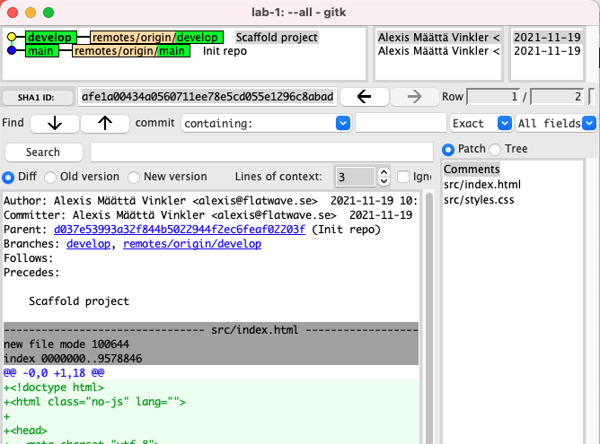

# Lab 1 - Branching & Merging

## Purpose & Goal
- Get comfortable working with branches
- Understand how the two main options (`merge` vs `rebase`) for integrating changes between branches works
- Understand how conflict resolution works

## Expectations
- Work in pairs
- For actions/operations performed on one computer – pair program!

## The assignment
### Step 1.1 - init repo
1. **_Dev-1_**: Create a new repository locally on your computer and add an empty `.gitignore`, commit it to your *__main__* branch and provide a decent commit message
1. **_Dev-1_**: Publish repo on GitHub
1. **_Dev-1_**: Invite your classmate as collaborator
1. **_Dev-2_**: Clone the repo
1. Verify that both of you have the code on your respective computers. By viewing the history locally using `gitk` it should look something like this:


### Step 1.2 - set baseline
1. **_Dev-1_**: Create a new branch, from the tip of your __*main*__ branch and call it `develop`
1. **_Dev-1_**: Copy the entire [src/](./src) folder from this repo (without modifying it) to the root of your project, `commit` and `push`
1. **_Dev-2_**: Verify that both of you have the latest code by pulling the `develop` branch. History should now look like this:

  

1. **_Dev-1_** & **_Dev-2_**: Verify that you can view [src/index.html](./src/index.html) in your browser.

  

### Step 1.3 - create own branches
1. **_Dev-1_** & **_Dev-2_**: From the tip of `develop` **create one branch each on your respective computers** (make sure to not give them the same name).
```
E.g.
$ git switch --create=my-cool-feature develop
```

  

1. **_Dev-1_** & **_Dev-2_**: `Push` your newly created branches and update your local repos with `fetch`.
```
$ git push --set-upstream origin my-cool-feature
$ git fetch
```
1. Verify that you are able to see each others branches in your local repository (using for example `gitk`)

  

### Step 1.4 - create divergent history
1. **_Dev-1_**: Modify the text inside the `<p>` tag in [index.html](./index.html), e.g. change it from _"Hello World!"_ to _"Hello Earth!"_; `commit` the change to your local branch and then `push` it to remote.
1. **_Dev-2_**: Modify the same `<p>` tag (but on your own branch) by adding the following css class `class="green"` to it; `commit` the change to your local branch and then `push` it to remote.
1. `Fetch` each others changes, your history should now resemble this (notice how the two branches have diverged):

  

### Step 1.5 - integrate changes (merge)
1. **_Dev-1_**: Join the two branches together by `merging` Dev-2's remote branch into your local feature branch. Resolve any potential conflicts and make sure both of your changes are respected.
```
E.g.
$ git merge origin/another-cool-feature
```

1. **_Dev-1_**: `Push` the merge commit to remote
1. **_Dev-2_**: `Pull` the changes so both of you have it locally

  

Congratulations, you have now completed the first part of this assignment! 🎉

---

### Step 2.1 - integrate changes (rebase)
With the recent `merge` process completed, let's redo the same integration using `rebase` instead!
1. **_Dev-1_**: Create a new branch from the commit just before the merge, for example using:
```
E.g.
$ git switch -c my-cool-feature-2 my-cool-feature~1
```

1. **_Dev-1_**: Now integrate the change from Dev-2's branch using `rebase` instead of `merge`
```
E.g.
$ git rebase origin/another-cool-feature
```

1. **_Dev-1_**: Resolve any potential conflicts and finish the rebase

  

  Congratulations, you have now completed the second part of this assignment! 🎉

---

### Step 3 - compare the outcomes
Compare the two outcomes from the `merge` and `rebase` process.
- How do they differ?
- What's the main difference between `merge` and `rebase`?
